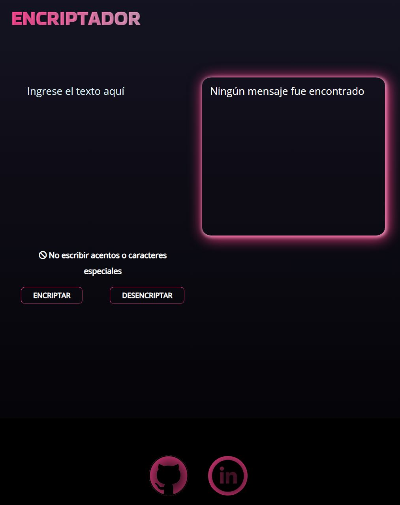

# 🚀 Encriptador Challenge | Oracle + Alura

    
    
    

    

## 📝 Descripción

Este proyecto es una aplicación web que utiliza HTML, CSS y JavaScript para encriptar y desencriptar texto. La encriptación se realiza mediante la sustitución de ciertas letras por otras según un conjunto específico de reglas. La aplicación solo acepta letras minúsculas y no se permiten acentos ni caracteres especiales.

La página web cuenta con campos de texto donde el usuario puede ingresar el texto que desea encriptar o desencriptar y seleccionar la opción correspondiente. El resultado de la operación se muestra en pantalla y existe la opción de copiar el texto encriptado o desencriptado al portapapeles mediante un botón de "copiar".

## 📒 Diccionarios
### 🔒 Diccionario de encriptación
| 🔑 Llave | ✏️ Reemplazo |
|-----------|-----------|
| e | enter |
| i | imes |
| a | ai |
| o | ober |
| u | ufat |

---

### 🔓 Diccionario de desencriptación
| 🔑 Llave | ✏️ Reemplazo |
|-----------|-----------|
| enter | e |
| imes | i |
| ai | a |
| ober | o |
| ufat | u |

## 📑 Requisitos

- ✅ Debe funcionar solo con letras minúsculas.
- ✅ No deben utilizarse letras con acentos ni caracteres especiales.
- ✅ Debe ser posible convertir una palabra en su versión encriptada y también devolver una palabra encriptada a su versión original. (Ejemplos: "gato" => "gaitober" | "gaitober" => "gato")
- ✅ La página debe tener campos para la inserción del texto que será encriptado o desencriptado, y el usuario debe poder seleccionar entre las dos opciones.
- ✅ El resultado debe mostrarse en pantalla.
- ✅ Un botón que copie el texto encriptado/desencriptado al portapapeles, con la misma funcionalidad que el comando "Ctrl+C" o la opción "Copiar" del menú de las aplicaciones.
